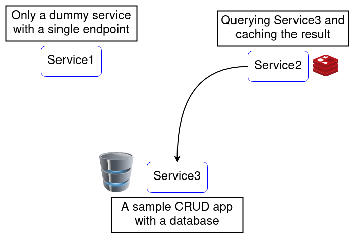

# DockerCon 2022 Talk

<!-- START doctoc generated TOC please keep comment here to allow auto update -->
<!-- DON'T EDIT THIS SECTION, INSTEAD RE-RUN doctoc TO UPDATE -->

- [Architecture](#architecture)
- [Structure of the repo](#structure-of-the-repo)
  - [How to run it?](#how-to-run-it)
    - [Prerequisites](#prerequisites)
    - [1. Separately](#1-separately)
    - [2. Entire platform](#2-entire-platform)
    - [URLs](#urls)
- [Agenda](#agenda)
  - [Development](#development)
  - [Dockerfile](#dockerfile)
  - [docker-compose.yml](#docker-composeyml)
- [Bonus](#bonus)

<!-- END doctoc generated TOC please keep comment here to allow auto update -->

This repo contains all the source, configurations, deployment tweaks that were
presented as a talk to [DockerCon 2022](https://mobile.twitter.com/dockercon).

To run the entire stack all in one place, just head to the `entire-platform`
directory and run `docker-compose up -d`.

## Architecture

The design of the platform is simple and straightforward, containing three apps
that are all web-apps listening on a HTTP port.

Service2 can also contact Service3 for a query in which it caches for future
reference. The invalidation of the cache is nothing special; it expires after
10 minutes (configurable).

The third service is a sample CRUD app that is talking to PostgreSQL for its
processing.

Here's an overview of the system:



## Structure of the repo

Each service has its own directory in here, but in real-life applications, each
of the following directories would have their own repository:

- service1
- service2
- service3

Also, the `traefik` directory contains the gateway/reverse-proxy and it's
generally just for the ease of access, and not necessarily a service for its
own.

Additionally, for ease of access, also the `entire-platform` directory is
placed next to others, but, again, in real life scenarios, it would have had
its own repository.

### How to run it?

**IMPORTANT NOTE**: Don't forget to
[update](https://github.com/docker/compose/releases) your docker-compose binary
to v2.

#### Prerequisites

You will need to add these two entries to your `/etc/hosts` file, regardless of
which approach you choose:

```env
127.0.0.1    svc.dockercon2022.com
127.0.0.1    svc-crud.dockercon2022.com
```

This is to tell our local DNS resolver to send the traffics of the mentioned
domains to the local machine (and ultimately to the `traefik` service).

#### 1. Separately

1. If you want to run the services separately, head to the
`individual-services` directory.
2. First, head to `traefik` directory and bring
up the app: `docker-compose up -d`. Now you're able to head to this link to see
your services and endpoints: <http://localhost:8080>
3. Head to each `serviceN` directory where `N` is the number of the service
and then bring up that service (again `docker-compose up -d`).

#### 2. Entire platform

Head to the `entire-platform` directory and bring up the apps, as easy as
`docker-compose up -d`.

#### URLs

These are the URLs you can access, whichever approach you choose:

| Service | Endpoint | Considerations |
| --- | --- | --- |
| service1 | <http://svc.dockercon2022.com/v1/> |
| service2 | <http://svc.dockercon2022.com/v2/> |
| service2-copy | <http://svc.dockercon2022.com/v3/> | Only `entire-platform` |
| service3 | <http://svc-crud.dockercon2022.com/v1/> |

## Agenda

The talk consists of three main components:

1. Development
2. Dockerfile
3. docker-compose.yml

### Development

- Anything that can be configurable and might need to be changed, should be
used as a configuration and not hard-coded.
- DO NOT commit environmental variables and especially secrets to your code.
Here's a link to help you better understand how to cleanly separate code from
configurations:
[Link to article](https://medium.com/licenseware/stop-committing-configurations-to-your-source-code-fb37be351492)
- You can place env-files in your Dockerfile, but try not to place secrets in
there, and also be midnful that they should be able to easily be overwritten
if they operations team wants to change them.
- Use GitHub Copilot to make your life much easier!

### Dockerfile

- Place static lines at the top of your Dockerfile. Here's a link to better
understand the advantages and the HOW-TOs:
[Link to article](https://medium.com/skilluped/10-tips-on-writing-a-proper-dockerfile-13956ceb435f)
- As much as possible, try to base your docker images from the smallest image;
this is both a security recommendation and an operation one.
- Use multi-stage builds to easily separate out different deployment modes.
- By default, the last stage of a multi-stage Dockerfile will be used if not
otherwise specified, so put your default stage on the last.
- It's always a good idea to use health-checks, they make your life a lot
easier and the visibility of your app/platform much more enhanced. You can also
place them in your `docker-compose.yml` file. The example for both approaches
are included in the repo:
  - Health check in `Dockerfile` inside `service1` directory
  - Health check in `compose-svc2.yml` file inside `entire-platform`
- For the sake of both security and maintainability, try to put
[dumb-init](https://github.com/Yelp/dumb-init/releases) as your entrypoint. It
may not look like it, but it's always a peace and comfort to your mind,
although any web-server would handle the signals for you these days.

### docker-compose.yml

- Everything you see in this repo has been tried with docker-compose v2, so
before going any further, make sure you update your docker-compose binary.
- Try to put ONLY the related services inside the same network, both for
security and for a good isolation. This way, those that don't have any business
with each other, won't be able to communicate (a security best practice).
- Use `env_file` directive in your `docker-compose.yml` files because otherwise
your file gets larger and harder to maintain.
- Try to expose the port in which your application is listening, so that you
and others can easily spot where to send the traffic. It can also be placed
inside the `Dockerfile` but because of the fact that the operation team might
decide to change it, you'd be better doing that in the `docker-compose.yml` for
a more consistent behavior.
- use `COMPOSE_FILE` to specify which files you would like to include for a
single stack. This will enable your to remove `-f compose-file.yml` from your
regular command line usage.
- `restart` is a very good directive to have in your docker-compose, don't
forget to include that for your services. Here's link to one article in that
regard:
[Link to article](https://medium.com/skilluped/stop-writing-mediocre-docker-compose-files-26b7b4c9bd14)
- ✅ Put related services in their own compose files so that you can easily
separate them out and change them accordingly without confusion.
- Don't try to mix the responsibility of services into a single container.
Always try to separate migrations, background-workers, web-apps, etc. into
their own container.
- In your local machine, you might find it useful to combine `extra_hosts`
directive with `/etc/hosts` file to forward the traffic from inside a
container to your own local machine and back to another container. Example
include `svc2` & `svc2-copy` in the `entire-platform` directory for different
approaches to communicate between your services.
- Use `tmux` and `-d` flag when you want to bring up your application. You
don't have to suffer from having multiple terminals open to have access to your
machine. Here's a link that you might find useful in that regard:
[Link to article](https://medium.com/amerandish/a-tmux-a-beginners-guide-7c129733148)
- The order of `COMPOSE_FILE` variable matters; try to place the definitions
first (left) and the invokation last (right). Checkout `.env` inside
`entire-platform` directory for an example.
- When using multiple `env_file` in your compose files for different services,
there's a good chance that some configurations are needed for more than one
service with the exact same value; try to follow DRY and use substitution so
that you don't have to write some key-value pair multiple times, but rather
refer back to it in the specific child `.env` file. That way, whenever you want
to change the value, you only need to change one place.
- Use `COMPOSE_PROJECT_NAME` to group your stack under a unified hierarchy.
This is done by default using directory name by docker, but try to take
control instead of letting it choose for you.

## Bonus

As a sample, the AWS CloudFormation sample template of how the real life stack
would be deployed has been placed inside the source code. In order to not
pollute the config, only a single service has a cloud-formation:
`individual-services/service1/cloudformation-templates/service1-dev.yml`

Also, the complete stack CloudFormation template has also been placed inside
the following directory:
`entire-platform/cloudformation-templates/stack-dev.yml`
